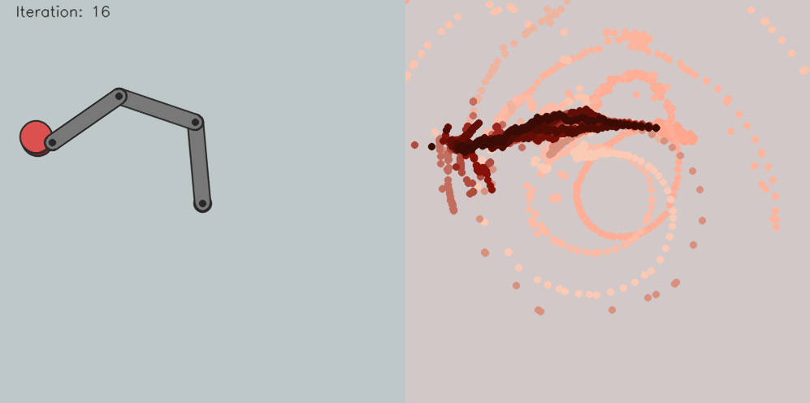

# locally-linear-LQG
Locally fitted dynamics for linear quadratic Gaussian controllers of a simulated 3 link robot arm. Roughly inspired by the [Guided Policy Search](https://papers.nips.cc/paper/5444-learning-neural-network-policies-with-guided-policy-search-under-unknown-dynamics.pdf) method for trajectory optimization.

The overall process is to:
1. Generate random controls for each timestep of the trajectory.
2. Execute the controls a number of times (with some noise) to sample the dynamics around the trajectory.
3. Fit locally linear models at each timestep using the samples of each timestep. 
4. Use the local models to improve the LQG controllers.

